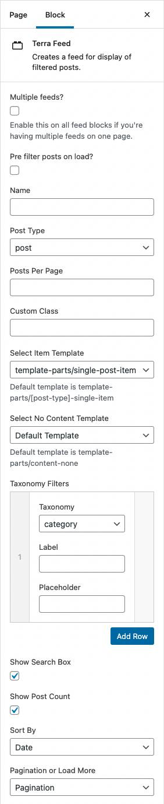

# Feed Block

Terra utilises Gutenberg and ACF functionality and adds a custom block which can be inserted into any page (with the Gutenberg editor enabled) and customised to pull in a feed of posts and filters.

Once added the block settings on the right hand side will display the following options:

1. Multiple feeds? _(checkbox)_
	- If you want to add multiple feeds on a single page enable this option for all blocks

2. Pre filter posts on load? _(checkbox)_
	- Enable this to filter the feed on page load with the specified taxonomy and term
	- Reveals sub-set of populated options:
		* Taxonomy _(select)_
		* Term _(select)_

3. Name _(text field)_
	- Give the form a custom name to use for Terra's internal functions and filters (see [Hooks & Filters]())
	- If left blank defaults to: `[post_type]-feed`

4. Post Type _(select)_
	- Field is populated with all public post types in theme

5. Posts Per Page _(integer)_
	- Overwrite how many posts to show per page (if blank defaults to blog settings)

6. Custom Class _(text field)_
	- Add custom classes to Terra feed block

7. Select Item Template _(select)_
	- Populated with all template files located in the `theme/template-parts` folder
	- If set to Default Template, Terra uses: `template-parts/[post-type]-single-item`
	- Set to Custom Template to reveal a text field where you can define your own template file relative to theme root

8. Select No Content Template _(select)_
	- Same as above, except defaults to: `template-parts/content-none`

9. Taxonomy Filters _(repeater)_
	- Allows user to add taxonomy filters
	- Each added row contains:
		* Taxonomy _(select)_
		* Label _(text field)_
		* Placeholder _(text field)_

10. Show Search Box _(checkbox)_
	- Displays search box

11. Show Post Count _(checkbox)_
	- Displays post count

12. Sort By _(select)_
	- Allows user to set how the posts are sorted
	- Options:
		* Disable (removes the sort filter)
		* Date
		* Title
		* Menu Order (this works alongside the [Post Types Order](https://en-gb.wordpress.org/plugins/post-types-order/) plugin)

13. Pagination or Load More _(select)_
	- Select whether to show pagination or the load more button

## Example

